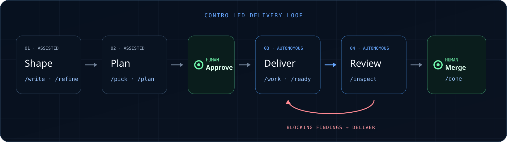

# Agent Workflows

**Turn a ticket into reviewed code, while keeping the important decisions human.**

[Install Agent Workflows](#quick-start) · [Explore the documentation](https://cyrilichti.github.io/agent-workflows/) · [See every workflow](https://cyrilichti.github.io/agent-workflows/workflows/)



## What it feels like

**You**

> I need a ticket for a new customer profile page.

**Agent**

> Let’s clarify the need, then create or update the ticket with your approval.<br>
> `/write`

**You**

> The ticket is ready. Start the work.

**Agent**

> I selected the item and prepared a delivery plan. I am waiting for your approval.<br>
> `/pick` → `/plan`

**You**

> Approved.

**Agent**

> The right skills implement and review the change. Blocking findings return to the delivery loop.<br>
> `/work` → `/ready` → `/inspect`

**You**

> Merge it.

**Agent**

> The reviewed pull request has been merged.<br>
> `/done`

You approve the plan before delivery and decide whether to merge. Everything
between those decisions stays structured, traceable, and ready for review.

## Quick start

```bash
npx skills add cyrilichti/agent-workflows --skill agent-workflows
```

Then run `/agent-workflows` once to install or update the system in your project.

## Built for the delivery loop

- Connected workflows own the handoff from intent to merge.
- Specialist skills are selected for the work at hand.
- Human approval boundaries remain explicit.
- Linear or ClickUp and GitHub or GitLab fit into the same lifecycle.

Agent Workflows installs into your project's `.agents/` context. See the
[installation guide](https://cyrilichti.github.io/agent-workflows/installation/)
for provider setup and update behaviour.

## Work with your existing tools

| Work items | Version control |
| --- | --- |
| Linear · ClickUp | GitHub · GitLab |

See [provider setup](https://cyrilichti.github.io/agent-workflows/providers/) for the required integrations.

## Documentation

Start with the [installation guide](https://cyrilichti.github.io/agent-workflows/installation/), then explore [provider setup](https://cyrilichti.github.io/agent-workflows/providers/) and the [workflow reference](https://cyrilichti.github.io/agent-workflows/workflows/).

## Community

New workflows and skill integrations are welcome. Read [Contributing](./CONTRIBUTING.md), [Support](./SUPPORT.md), [Security](./SECURITY.md), and the [Code of Conduct](./CODE_OF_CONDUCT.md).

## License

[MIT](./LICENSE)
