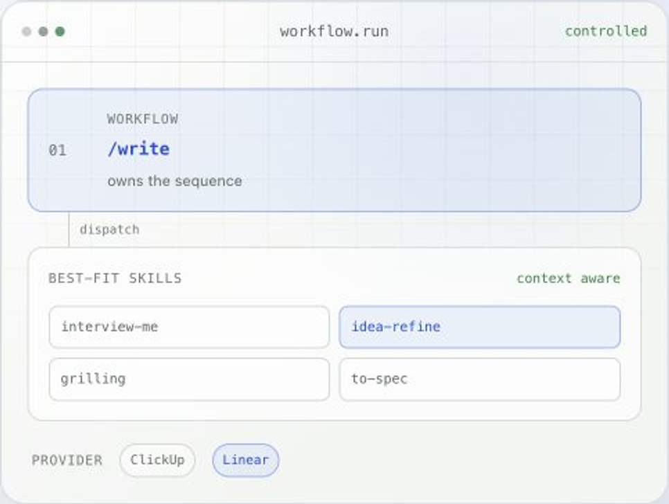

# agent-workflows

Skills are good at individual jobs. They do not decide which specialist should
run next, how context moves between steps, or when an agent is allowed to change
your work tracker and repository.

`agent-workflows` is the workflow that connects them. One install adds a complete delivery system to your coding agent—from rough intent to merged request—with the right skill at each step and approval before every consequential action.

<p>
  <picture>
    <source media="(prefers-color-scheme: dark)" srcset="./public/workflow-routing-dark.png">
    <source media="(prefers-color-scheme: light)" srcset="./public/workflow-routing-light.png">
    
  </picture>
  <a href="https://cyrilichti.github.io/agent-workflows/">Documentation</a><br>
  <a href="https://cyrilichti.github.io/agent-workflows/installation/">Installation</a><br>
  <a href="https://cyrilichti.github.io/agent-workflows/workflows/">Explore the workflows</a>
  <br clear="right">
</p>

## One install.

```bash
npx skills add cyrilichti/agent-workflows --skill agent-workflows
```

Then run `/agent-workflows` once to install or update the system in your project.

It brings together:

- **8 connected workflows** that own the delivery lifecycle;
- **34 curated skills** selected from specialized upstream packages;
- **specialist agent profiles** for implementation, product, design, data,
infrastructure, quality, and review;
- **reusable commands and rules** for repeatable execution;
- **provider routing** for Linear or ClickUp and GitHub or GitLab.

It installs into your project's `.agents/` context and keeps upstream skill
dependencies recorded in `skills-lock.json`.

## From intent to done


| Stage       | Purpose                                                    | Workflows            |
| ----------- | ---------------------------------------------------------- | -------------------- |
| **Shape**   | Turn intent into a clear, right-sized work item            | `/write` · `/refine` |
| **Plan**    | Select the work and approve how it will be delivered       | `/pick` · `/plan`    |
| **Deliver** | Execute the plan, validate the result, and prepare review  | `/work` · `/ready`   |
| **Review**  | Inspect an exact snapshot, merge it, and complete the item | `/inspect` · `/done` |


## The problem it solves

- **Skills stay isolated.** Workflows select and sequence them around a concrete
delivery outcome.
- **Agents improvise the process.** Each workflow defines what happens, what
context is preserved, and where execution stops.
- **Context gets lost between prompts.** Approved outputs are handed to the next
workflow instead of being reconstructed.
- **Tool calls hide side effects.** Commits, pushes, reviews, merges, and provider
updates stay behind explicit approval boundaries.
- **Tickets and code drift apart.** Item and version providers are updated as one
connected lifecycle.

This is not another collection of prompts. It is the control layer that makes
specialized skills work together as a delivery system.

## Start a workflow

Invoke the activity you need. The workflow loads the relevant context, selects
the required skills and specialists, controls their sequence, and can dispatch
the approved result to the next workflow.

```text
/write → /refine → /plan → /work → /ready → /inspect → /done
```

You can also enter the lifecycle at any workflow—for example `/pick` to select
an existing item before planning it.

## Works with


| Work items       | Version control |
| ---------------- | --------------- |
| Linear · ClickUp | GitHub · GitLab |


The corresponding MCP servers must be connected to the AI client running the
workflows. See the [provider setup](https://cyrilichti.github.io/agent-workflows/providers/).

## Documentation

Explore the [installation guide](https://cyrilichti.github.io/agent-workflows/installation/),
[provider setup](https://cyrilichti.github.io/agent-workflows/providers/), and
[workflow reference](https://cyrilichti.github.io/agent-workflows/workflows/).

## License

[MIT](./LICENSE)
