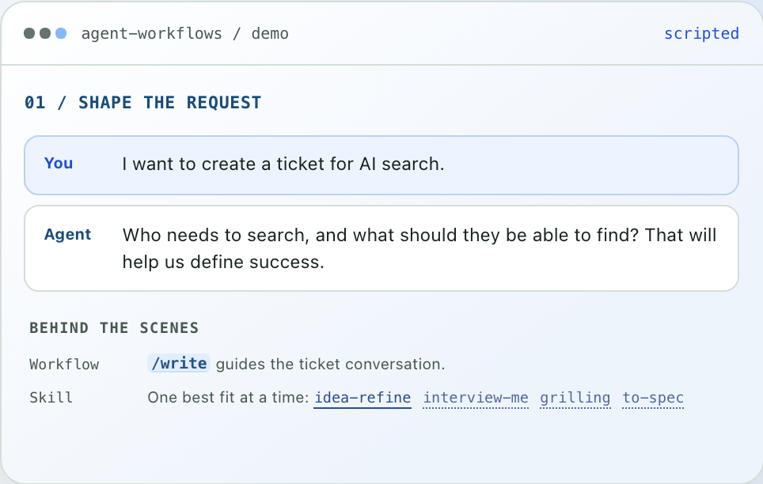

# Agent Workflows

**Turn a ticket into reviewed code. Keep the final say.**

[Documentation](https://cyrilichti.github.io/agent-workflows/) · [Installation](https://cyrilichti.github.io/agent-workflows/installation/) · [Workflows](https://cyrilichti.github.io/agent-workflows/workflows/) · [Orchestration](https://cyrilichti.github.io/agent-workflows/orchestration/)

Use the same delivery workflows with your agent or through orchestration. This no-code approach takes approved plans to reviewed code, while you keep the final merge decision.

## Orchestrate delivery or code with your agent

<table>
  <tr>
    <td width="48%" valign="middle">
      <picture>
        <source media="(prefers-color-scheme: dark)" srcset="./public/readme-orchestration-dark.png">
        <source media="(prefers-color-scheme: light)" srcset="./public/readme-orchestration-light.png">
        
      </picture>
    </td>
    <td valign="middle">
      <h3>Orchestrate delivery</h3>
      <p>Approve a plan, then let orchestration pick up the prepared work. It carries the change through delivery and review, then brings it back for your merge decision.</p>
      <p><a href="https://cyrilichti.github.io/agent-workflows/orchestration/">Set up orchestration →</a></p>
    </td>
  </tr>
</table>

<table>
  <tr>
    <td width="48%" valign="middle">
      <picture>
        <source media="(prefers-color-scheme: dark)" srcset="./public/readme-agent-demo-dark.png">
        <source media="(prefers-color-scheme: light)" srcset="./public/readme-agent-demo-light.png">
        
      </picture>
    </td>
    <td valign="middle">
      <h3>Code with your agent</h3>
      <p>Describe your goal in natural language. A focused workflow guides the conversation and selects the right skill for each step, from shaping the ticket to delivery.</p>
      <p><a href="https://cyrilichti.github.io/agent-workflows/workflows/">Explore the workflows →</a></p>
    </td>
  </tr>
</table>

## Install in your project

From the root of a Git project, install the bootstrap skill:

```bash
npx skills add cyrilichti/agent-workflows --skill agent-workflows
```

Then invoke `/agent-workflows` in your coding agent to install or update the workflow instructions and choose your providers. Follow the [installation guide](https://cyrilichti.github.io/agent-workflows/installation/) for prerequisites and setup.

## Connect your tools

| Responsibility | Supported providers |
| --- | --- |
| Tickets and plans | Linear, ClickUp |
| Pull or merge requests | GitHub, GitLab |
| AI tasks in orchestration | Codex CLI, OpenAI API |

See [provider setup](https://cyrilichti.github.io/agent-workflows/providers/) to get started.

## Contribute

Read [Contributing](./CONTRIBUTING.md) to propose a workflow or improve an existing one. For help or responsible reporting, see [Support](./SUPPORT.md) and [Security](./SECURITY.md). Community participation follows the [Code of Conduct](./CODE_OF_CONDUCT.md).

## License

[MIT](./LICENSE)
