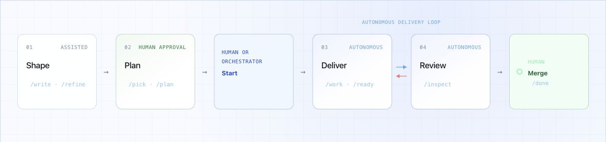

# Agent Workflows

**Turn prepared work into reviewed code. Keep the final say.**

A shared workflow for delivering changes with your coding agent or through
autonomous orchestration.

## Orchestrate delivery

Let an orchestrator select prepared tickets with approved plans and run
implementation, checks, review, and correction. Each reviewed change awaits
your merge decision.

Follow the [orchestration guide](./ORCHESTRATION.md) to set up the delivery loop.

<picture>
  <source media="(prefers-color-scheme: dark)" srcset="./public/readme-orchestration-dark.gif">
  <source media="(prefers-color-scheme: light)" srcset="./public/readme-orchestration-light.gif">
  
</picture>

## Work with your agent

Shape a ticket, approve the plan, and start delivery from your agent's chat.
The agent implements, checks, and reviews the change for your merge decision.

Explore the [workflow reference](https://cyrilichti.github.io/agent-workflows/workflows/).

<picture>
  <source media="(prefers-color-scheme: dark)" srcset="./public/readme-agent-dark.jpg">
  <source media="(prefers-color-scheme: light)" srcset="./public/readme-agent-light.jpg">
  
</picture>

## Quick start

```bash
npx skills add cyrilichti/agent-workflows --skill agent-workflows
```

Then run `/agent-workflows` once to install or update the system in your project.
See the [installation guide](https://cyrilichti.github.io/agent-workflows/installation/)
for setup options.

## Work with your existing tools

| Work items | Version control |
| --- | --- |
| Linear · ClickUp | GitHub · GitLab |

See [provider setup](https://cyrilichti.github.io/agent-workflows/providers/) for the required integrations.

## Documentation

To start the documentation development server, install dependencies with
`npm ci`, then run `npm run doc`.

## Community

New workflows and skill integrations are welcome. Read [Contributing](./CONTRIBUTING.md), [Support](./SUPPORT.md), [Security](./SECURITY.md), and the [Code of Conduct](./CODE_OF_CONDUCT.md).

## License

[MIT](./LICENSE)
