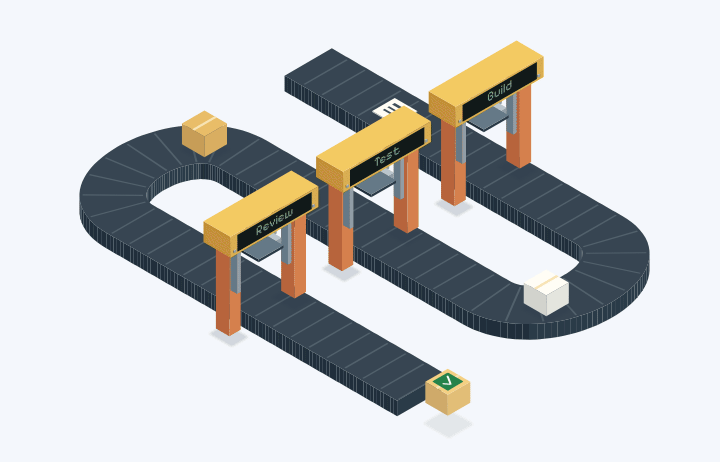

# Agent Workflows

**Turn prepared work into reviewed code. Keep the final say.**

Use Agent Workflows in two ways: work directly with your coding agent to shape,
plan, and deliver a change, or let an orchestrator select prepared, planned
tickets and run their delivery loop. You approve the plan and decide what gets
merged. Between those decisions, the system implements, checks, reviews, and
corrects the change until reviewed code is ready.

<picture>
  <source media="(prefers-color-scheme: dark)" srcset="./public/readme-orchestration-dark.gif">
  <source media="(prefers-color-scheme: light)" srcset="./public/readme-orchestration-light.gif">
  
</picture>

## Quick start

```bash
npx skills add cyrilichti/agent-workflows --skill agent-workflows
```

Then run `/agent-workflows` once to install or update the system in your project.
See the [installation guide](https://cyrilichti.github.io/agent-workflows/installation/)
for setup options.

## Work with your existing tools

| Work items | Version control |
| --- | --- |
| Linear · ClickUp | GitHub · GitLab |

See [provider setup](https://cyrilichti.github.io/agent-workflows/providers/) for the required integrations.

## Documentation

Explore the [workflow reference](https://cyrilichti.github.io/agent-workflows/workflows/)
to see how work moves from a ticket to a merge decision. To run planned tickets
through the autonomous delivery loop, follow the
[orchestration guide](./ORCHESTRATION.md).

To start the documentation development server, install dependencies with
`npm ci`, then run `npm run doc`.

## Community

New workflows and skill integrations are welcome. Read [Contributing](./CONTRIBUTING.md), [Support](./SUPPORT.md), [Security](./SECURITY.md), and the [Code of Conduct](./CODE_OF_CONDUCT.md).

## License

[MIT](./LICENSE)
