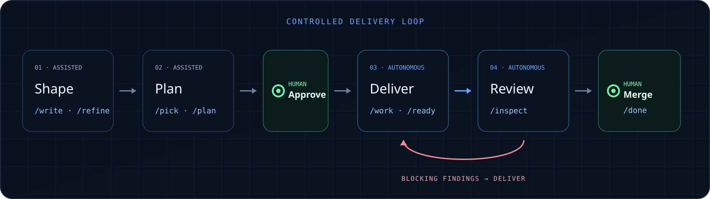
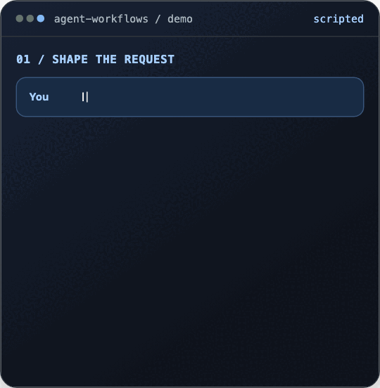

# Agent Workflows

**Automate the delivery loop. Keep the final say.**

[Install Agent Workflows](#quick-start) · [Explore the documentation](https://cyrilichti.github.io/agent-workflows/) · [See every workflow](https://cyrilichti.github.io/agent-workflows/workflows/)



## Quick start

```bash
npx skills add cyrilichti/agent-workflows --skill agent-workflows
```

Then run `/agent-workflows` once to install or update the system in your project.

## What it feels like

[](https://cyrilichti.github.io/agent-workflows/)

[Open the full demo](https://cyrilichti.github.io/agent-workflows/) to explore each step and its behind-the-scenes details.

Agent Workflows installs into your project's `.agents/` context. See the
[installation guide](https://cyrilichti.github.io/agent-workflows/installation/)
for provider setup and update behaviour.

## Work with your existing tools

| Work items | Version control |
| --- | --- |
| Linear · ClickUp | GitHub · GitLab |

See [provider setup](https://cyrilichti.github.io/agent-workflows/providers/) for the required integrations.

## Documentation

Start with the [installation guide](https://cyrilichti.github.io/agent-workflows/installation/), then explore [provider setup](https://cyrilichti.github.io/agent-workflows/providers/) and the [workflow reference](https://cyrilichti.github.io/agent-workflows/workflows/).

## Community

New workflows and skill integrations are welcome. Read [Contributing](./CONTRIBUTING.md), [Support](./SUPPORT.md), [Security](./SECURITY.md), and the [Code of Conduct](./CODE_OF_CONDUCT.md).

## License

[MIT](./LICENSE)

## Local AI workflow (Docker)

Run Flowise and Langfuse locally, with Codex or the OpenAI API for inference.
Only **Docker with Compose 2.24+** is required to run the stack. On Apple Silicon,
this stack was tested with approximately 10 GB of Docker memory.

### Start

From the repository root, on a new installation:

```bash
cp .env.example .env
# Fill the secrets and passwords in .env, then:
docker compose up -d --build
```

Choose your own distinct secrets; a password manager or `openssl rand -hex 32`
can generate each value. Compose rejects missing required values. It never
creates or rewrites `.env`. Keep this file private and retain its values across
restarts. The `workflow-init` container creates the Flowise account and imports
the example once, preserving subsequent edits.

- **Flowise:** http://localhost:3000 — use `FLOWISE_ADMIN_EMAIL` and `FLOWISE_ADMIN_PASSWORD`.
- **Langfuse:** http://localhost:3001 — use `local@example.test` and `LANGFUSE_ADMIN_PASSWORD`.

With the default Codex profile, sign in explicitly once:

```bash
docker compose exec bridge codex -c 'cli_auth_credentials_store="file"' login --device-auth
docker compose exec bridge codex login status
```

Follow the displayed link and code in your browser. Login stays in a Docker
volume; your host Codex configuration is not copied or mounted. After checking
your allowance, set `INFERENCE_ENABLED=true` in `.env` and run
`docker compose up -d` to apply it.

In Flowise, open **Agentflows → Local AI — Codex or API → Chat**. Enter a unique
`requestId` (such as `my-first-run-001`) and a prompt. The response includes its
Langfuse trace link, also accessible through **Local AI workflow → Tracing**.
Reusing the same ID and prompt returns the saved response without another inference.

### Everyday commands

| Command | Action |
| --- | --- |
| `docker compose up -d --build` | Start services or apply code/configuration changes |
| `docker compose stop` | Stop services, keeping data |
| `docker compose logs --tail 80` | Show recent service logs (including initialization) |
| `npm run test` | Run tests without model calls; requires Node 22.12+ |
| `npm run doc` | Start the documentation website; requires Node and `npm install` |

### Configuration

Choose exactly one provider in the **root `.env`**:

| Setting | Codex subscription | OpenAI API |
| --- | --- | --- |
| `COMPOSE_PROFILES` | `codex` (default) | `openai-api` |
| `AI_MODEL` | `gpt-6-luna` | A model available to your API project |
| `OPENAI_API_KEY` | Leave empty | Your Platform project token |
| `INFERENCE_ENABLED` | `true` after checking allowance | `true` after checking API funding |

To switch providers, **run `docker compose stop` before changing the profile**,
then edit `.env` and run `docker compose up -d --build`. Only one bridge may run
at a time. API billing is separate from ChatGPT; there is no automatic fallback
or credit purchase. Live API inference has not been verified with a funded token.

<details>
<summary>Existing installations, technical details and troubleshooting</summary>

**Migrating from the previous npm launcher:** keep your existing `.env`.
Copy the email/password from `.local/flowise-account.json` into
`FLOWISE_ADMIN_EMAIL` / `FLOWISE_ADMIN_PASSWORD`. Set
`VOLUME_PREFIX=agent-workflows-ai` and `EXTERNAL_VOLUMES=true` to keep your data
and Codex login,
then run these commands once:

```bash
docker compose -p agent-workflows-ai --profile codex --profile openai-api down
docker compose up -d --build
```

Do not add `-v`: it deletes volumes. The project and containers now use
`agent-workflows`; existing volumes keep their old names. New installations
use `agent-workflows` for both. The initializer adopts the existing example by
name; keep its name `Local AI — Codex or API` for the migration. Its stored ID
then preserves it even after renaming. Old `.local/` files are no longer used.

There is one root `compose.yaml`. Dockerfiles and the initializer live in
`.docker/`; dependencies are installed during image builds. Node is needed on
the host only for tests and the Astro documentation. The API image has neither
Codex nor its authentication volume. UI passwords initialize accounts once;
change existing passwords in the UI (also update Flowise's password in `.env`).

Only ports 3000/3001 are exposed, on localhost. The private bridge runs as
non-root with a read-only root filesystem and permits one inference at a time.
Flowise 3.1.4, Langfuse 4.48.0, PostgreSQL 17.6, ClickHouse 25.12, Redis 7.2.6,
MinIO and Codex CLI 0.159.2 are pinned. Model inference requires internet access.

- If the example is missing, check `docker compose logs workflow-init`.
  A successful initializer exits with code 0; it is not a long-running service.
- Check Docker is running and ports 3000/3001 are free. The workflow network
  uses `172.30.81.0/24`; do not run two copies of this stack simultaneously.
- For expired/revoked Codex access, repeat the login command above. Optional
  `CODEX_WORKSPACE_ID` restricts authentication to your chosen ChatGPT workspace.
- `traceStatus=pending` retries trace delivery without repeating inference.
  `unknown` means an interrupted request may have consumed usage; reuse its ID
  to read its saved state. `accepted` means ingestion accepted; verify it in
  Langfuse. Subscription token counts are not API costs.
- Back up `.env` and named Docker volumes together. Avoid sharing secrets,
  private prompts or logs; back up before upgrading.

This is a trusted local trial. Flowise has announced its
[end of life](https://flowiseai.com/sunset); evaluate maintenance before a
production deployment. Community licenses: Flowise Apache-2.0, Langfuse MIT
core, PostgreSQL PostgreSQL License, ClickHouse Apache-2.0, Redis 7.2 BSD-3-Clause,
MinIO AGPL-3.0. Enterprise features, Docker Desktop licensing and model usage
have separate terms. Production also requires access control, TLS, backups
and retention policies.

</details>
